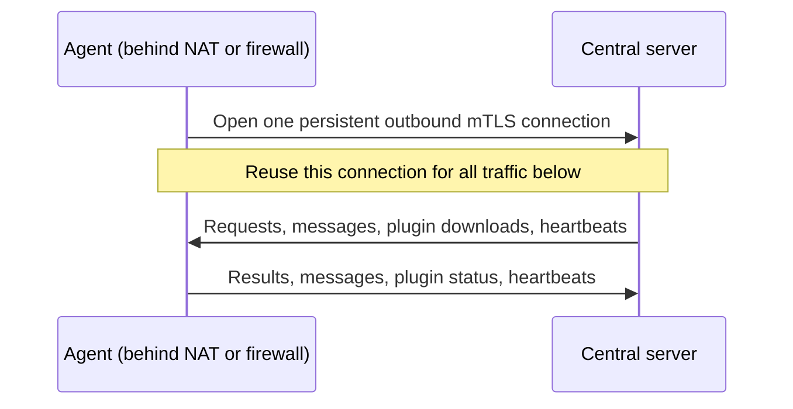
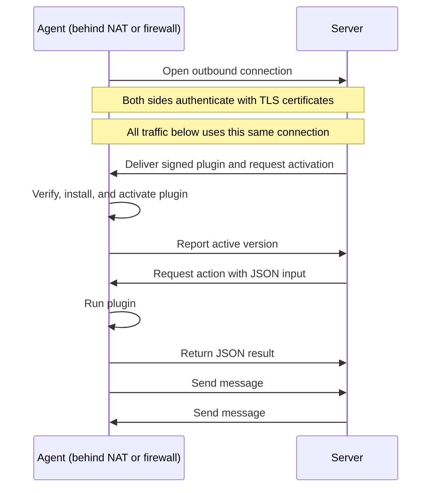

# bidi - A bi-directional agent/server pattern in Go

> This is example code for exploring the architectural pattern. It is not intended for production use.

bidi is a Go server and agent that demonstrates a common, well-known pattern: an agent opens a persistent outbound connection to a central server, then uses it for bidirectional communication. Here, the connection uses TLS, and both sides authenticate with certificates. That connection stays open for requests, results, and messages in either direction.

## Value

The agent only needs outbound access to the server. You can run it behind NAT or a firewall without opening inbound ports or giving it a public IP address. If the connection drops, the agent reconnects automatically.

Once connected, either side can send messages. The server can ask the agent to run an action and get its result over the same connection.

You can also add or update signed plugins over that connection without redeploying the agent. Activate a new version, or roll back to the previous one. The examples include status, echo, host facts, and disk usage. Plugins run with the agent's permissions.

## One connection

The agent opens the connection. The server uses it to send requests and plugins back to the agent; neither needs a second connection.



## Connection flow



## Try it

You need Linux, Go 1.22+, Make, OpenSSL, GCC, Python 3, and `flock` (from util-linux).

Create development certificates once:

```sh
make certs
```

Start each process in a separate terminal:

```sh
# Terminal 1
make server

# Terminal 2
make client-1
```

The Make targets build the binaries and prepare signed example plugins. The agent downloads and activates them when it connects. Run these commands in a third terminal and watch the server terminal for results:

```sh
make plugins
make status
make echo TEXT="hello"
make host-facts
make disk-usage

# Add the uptime plugin while the agent is running
make plugin-add
make uptime
```

To try a second agent, create its identity before starting the server, then start the agent in another terminal:

```sh
make agent NAME=agent-2
make client-2
```

Target it with `make status AGENT=agent-2`. Use `make help` for more commands and `make test` to run the tests.

[MIT license](LICENSE).
